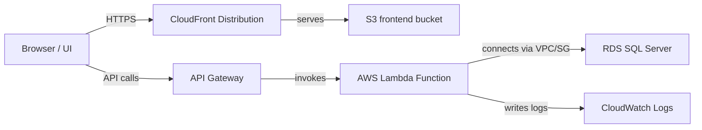

# AccountDB PoC

Central repository for the Account/Policy Explorer proof-of-concept, including a Spring Boot API, UI screenshots, and a serverless AWS deployment stack.

## Table of Contents

- [Overview](#overview)
- [Features](#features)
- [Getting Started](#getting-started)
- [Local Development](#local-development)
- [Serverless Deployment](#serverless-deployment)
- [Architecture](#architecture)
- [Access](#access)
- [Screenshots](#screenshots)
- [Notes](#notes)

## Overview

This project demonstrates a policy management workflow with authentication, policy browsing, detail views, and CRUD operations.

The repo contains:

- a Spring Boot app under `src/main/java/com/bezkoder/springjwt`
- AWS serverless deployment code under `terraform/serverless`
- a Lambda backend project under `serverless/policy-api`

## Features

- JWT-based authentication
- User, role, and policy management
- Policy search and detail views
- Serverless frontend delivery using S3 + CloudFront
- API backend hosted on AWS Lambda behind API Gateway
- Secure connectivity to an existing RDS SQL Server instance

## Getting Started

### Prerequisites

- Java 17+
- Maven
- Git
- SQL Server for local database testing

### Build and run locally

From the repo root:

```bash
cd C:\Users\rohit\Desktop\github\accountdb-poc
./mvnw clean package
./mvnw spring-boot:run
```

The app uses environment variables from `src/main/resources/application.properties` if not set explicitly.

### Environment variables

```powershell
$env:DB_URL = 'jdbc:sqlserver://localhost:1433;databaseName=customerDB;encrypt=false;trustServerCertificate=true'
$env:DB_USERNAME = 'sa'
$env:DB_PASSWORD = 'YourStrong@Passw0rd'
$env:SERVER_PORT = '9000'
```

## Local Development

The root Spring Boot application is configured in `src/main/java/com/bezkoder/springjwt` and uses Spring Security with JWT.

Key folders:

- `src/main/java/com/bezkoder/springjwt/controllers`
- `src/main/java/com/bezkoder/springjwt/service`
- `src/main/java/com/bezkoder/springjwt/models`
- `src/main/resources/application.properties`

## Serverless Deployment

The serverless infrastructure and Lambda backend live under `terraform/serverless` and `serverless/policy-api`.

Use the Terraform-specific README at `terraform/serverless/README.md` for full deployment steps.

### Quick deploy steps

```powershell
cd terraform\serverless
terraform init
terraform plan
terraform apply
```

After Terraform applies, it outputs the CloudFront URL for the deployed frontend.

## Architecture

This repo includes the application stack plus AWS infrastructure for serverless deployment.

### Application components

- **Frontend / UI**: browser-based client for login, policy browsing, and policy CRUD operations.
- **Backend API**: Java/Spring Boot service or Lambda handler for auth and policy endpoints.
- **Database**: SQL Server storing users, roles, policies, and related metadata.

### AWS infrastructure

The `terraform/serverless` stack covers:

- S3 bucket for the static frontend
- CloudFront distribution for public delivery
- API Gateway HTTP API for incoming requests
- AWS Lambda for the backend policy API
- VPC and security group wiring for SQL Server access
- CloudWatch Logs for Lambda execution monitoring

### Architecture diagram



## Access

- **Username:** policyadmin
- **Password:** Admin@123456
- **Deployment URL:** d1j6y0oytf2kht.cloudfront.net

## Screenshots

Copy your screenshots into `docs/images/` so they render on GitHub.

- **UI-1 — Login screen:** shows the login form where users enter `policyadmin` and the demo password.
- **UI-2 — Dashboard / Policies list:** lists existing policies with quick actions (view/edit/delete).
- **UI-3 — Policy details:** detailed view of a single policy including metadata and related records.
- **UI-4 — Create / Edit policy:** form to add or update policy information and save changes.


## Notes

- If you want the screenshots to display on GitHub, make sure `docs/images/` is committed.
- The serverless Terraform stack references an existing RDS instance and does not create it.
- Avoid publishing sensitive credentials in a public repository.


