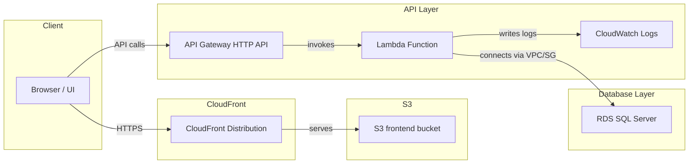
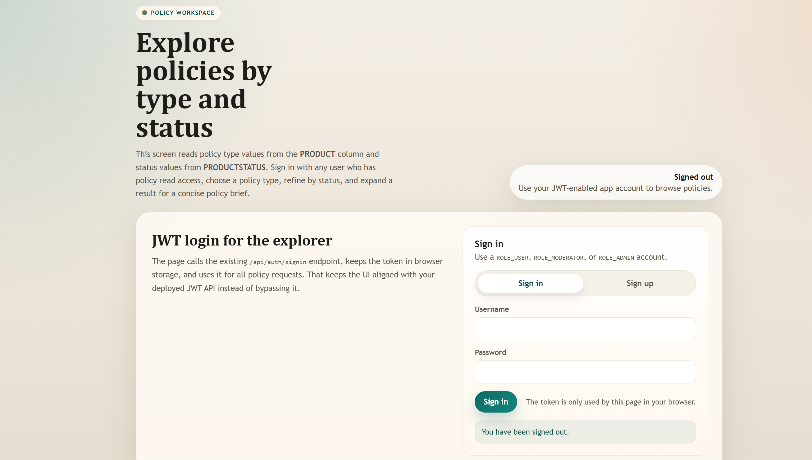
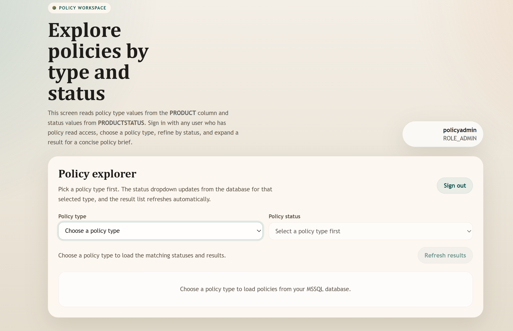
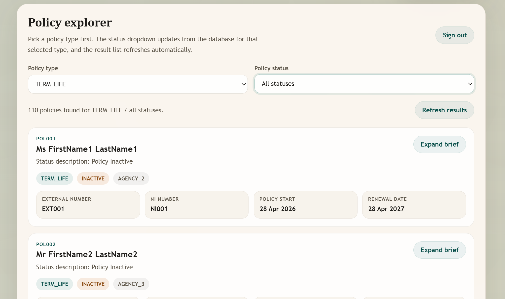
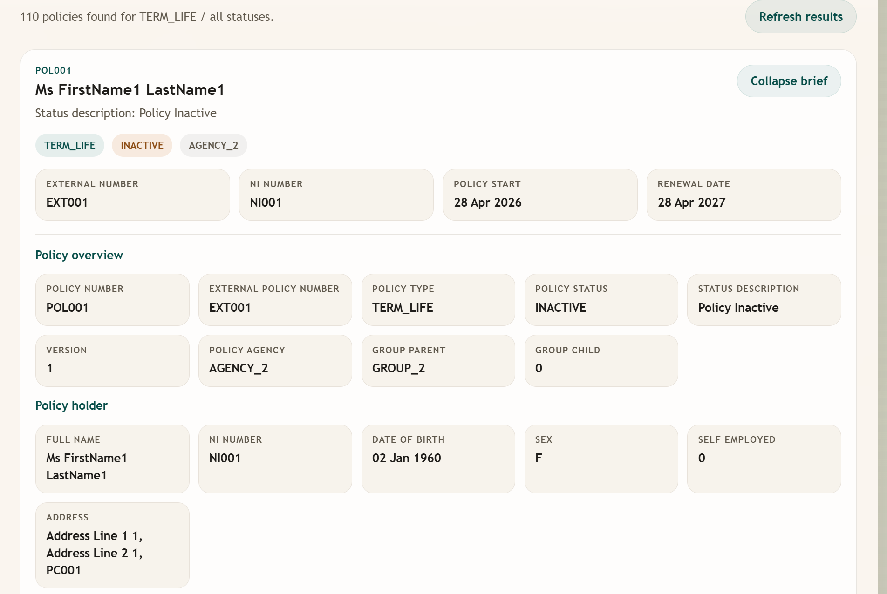

# AccountDB PoC

Lightweight proof-of-concept for an account/policy management API and UI.

## Quick Start

Prerequisites: Java 17+, Maven. From the repo root run:

```bash
./mvnw clean package
java -jar target/*.jar
```

## Access

- **Username:** policyadmin
- **Password:** Admin@123456

## Deployment URL

d1j6y0oytf2kht.cloudfront.net

## Architecture

This repo supports both the application layer and the AWS serverless infrastructure used to deploy it.

### Application components

- **Frontend / UI**: browser-based client for login, policy browsing, and policy CRUD operations.
- **Backend API**: Java/Spring Boot service that handles authentication, policy APIs, and business logic.
- **Database**: SQL Server storing users, roles, policies, and related metadata.

### AWS infrastructure

The `terraform/serverless` folder provisions the serverless deployment stack:

- **S3 bucket** for the static frontend files.
- **CloudFront distribution** to serve the app from a single public URL.
- **API Gateway (HTTP API)** to route API requests to Lambda.
- **AWS Lambda** running the Java policy API handler in a VPC.
- **Security Group wiring** to allow Lambda to connect to an existing RDS SQL Server.
- **CloudWatch Logs** for Lambda execution logging.

### Architecture diagram



### Component details

- `Browser / UI`: static website hosted on S3 and delivered through CloudFront.
- `CloudFront`: global CDN that serves the frontend and can proxy API calls.
- `API Gateway`: handles incoming HTTP requests and forwards them to Lambda.
- `AWS Lambda`: executes the Java `PolicyApiHandler` and accesses the SQL Server database.
- `RDS SQL Server`: external database referenced by Terraform `data` sources, not created by this stack.
- `CloudWatch Logs`: stores Lambda execution logs for debugging and monitoring.

## Screenshots

Below are the main UI screens for the PoC. Copy your screenshots into `docs/images/` so they render on GitHub.

- **UI-1 — Login screen:** shows the login form where users enter `policyadmin` and the demo password.
- **UI-2 — Dashboard / Policies list:** lists existing policies with quick actions (view/edit/delete).
- **UI-3 — Policy details:** detailed view of a single policy including metadata and related records.
- **UI-4 — Create / Edit policy:** form to add or update policy information and save changes.







